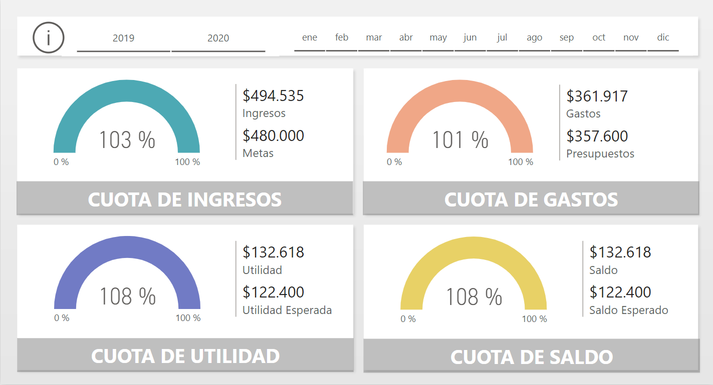
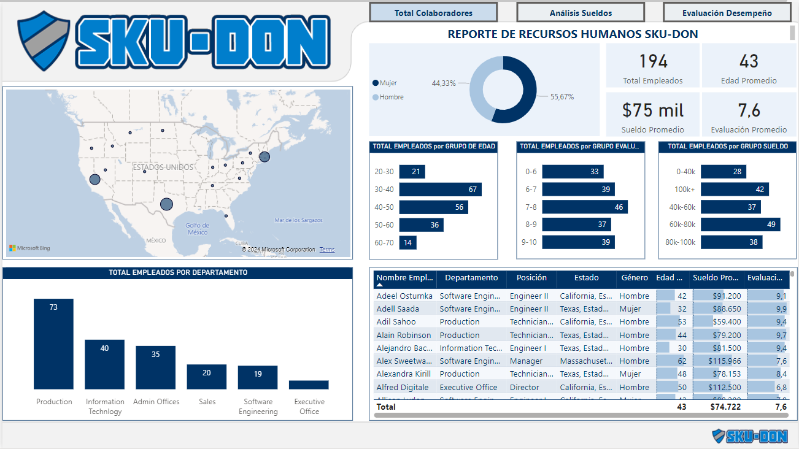
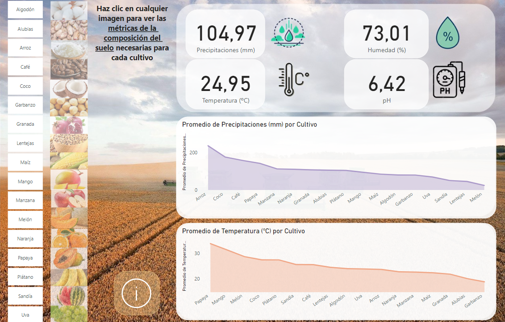
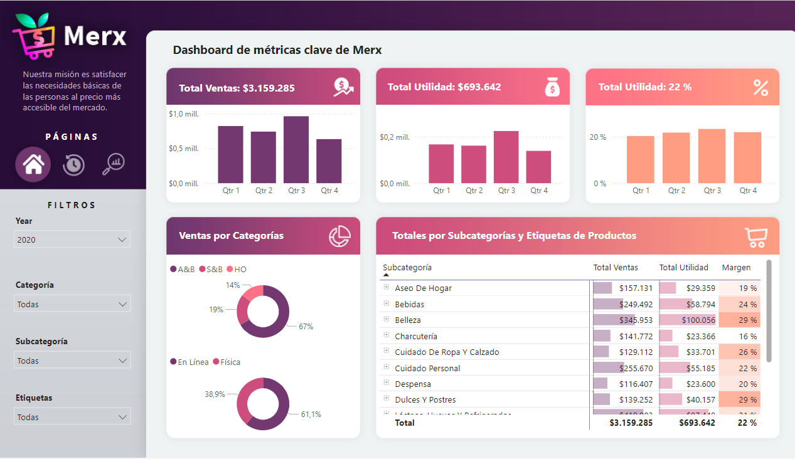

# Portfolio PowerBI

En este repositorio encontrarás los enlaces a los reportes en los que he trabajado utilizando la herramienta de Microsoft PowerBI para el análisis y visualización de datos. Las áreas son diversas: Agricultura, recursos humanos, finanzas personales o análisis de negocios.

#### 🔍 Los paneles generados incluyen:

- Tablas Calendario para crear gráficos de series temporales.
- Generar nuevas medidas usando DAX y lenguaje M.
- Manejo de indicadores KPIs (Key Performance Indicators).
- Uso de formatos condicionales en las tablas, con diferentes colores de fondo basados en los filtros aplicados.
- Botones de navegación entre las diferentes páginas del dashboard.

## 1. Análisis de finanzas personales

Este panel incluye un seguimiento detallado de los ingresos y gastos mensuales por categorías como comida, transporte, electricidad, entretenimiento, etc. Además, se pueden analizar las tendencias a lo largo de los meses y años.

### 📌 [Enlace al panel](https://app.powerbi.com/view?r=eyJrIjoiYmM1ZTNkOTYtNjA5OS00NTY1LWE1YzMtMWZmNjUyNGQ0YjY5IiwidCI6IjhhZWJkZGI2LTM0MTgtNDNhMS1hMjU1LWI5NjQxODZlY2M2NCIsImMiOjl9)

## 2. Reporte de recursos humanos

Este panel incluye un estudio del departamento de recursos humanos de la empresa ficticia Sku-Don. En él, se detallan el total de empleados, el análisis de los sueldos y la evaluación de desempeño de los diferentes trabajadores en base a diferentes variables.

### 📌 [Enlace al panel](https://app.powerbi.com/view?r=eyJrIjoiY2QyOGViNjgtNzIzMi00MWNhLWE1MGItOGFlZjk1MzMzMDRjIiwidCI6IjhhZWJkZGI2LTM0MTgtNDNhMS1hMjU1LWI5NjQxODZlY2M2NCIsImMiOjl9)

## 3. Análisis de datos agricultura

Este panel incluye un análisis de los datos del balance de nutrientes esenciales para el crecimiento de diferentes cultivos que consumimos a diario, así como de los niveles de precipitaciones, temperatura, humedad o pH necesarios para cada cultivo. Incluye también un análisis de la eficiencia del uso de nutrientes (nutrientes aplicados al suelo VS nutrientes absorbidos por los cultivos). Esta eficiencia puede variar considerablemente según la región, debido a factores como el tipo de suelo, clima, prácticas agrícolas o acceso a fertilizantes.

### 📌 [Enlace al panel](https://app.powerbi.com/view?r=eyJrIjoiY2NlNTM0YTMtYzYwMS00NmRmLWEwM2YtNGM4ZmJmMjA1Y2ExIiwidCI6IjhhZWJkZGI2LTM0MTgtNDNhMS1hMjU1LWI5NjQxODZlY2M2NCIsImMiOjl9)

## 4. Reporte de análisis de ventas I

Este panel incluye una comparativa del total de ingresos actuales VS año o mes anterior en un negocio de artículos tecnológicos. En él se utilizan segmentadores para filtrar por continentes, categorías y años.

### 📌 [Enlace al panel](https://app.powerbi.com/view?r=eyJrIjoiNDdkNDIzZmYtN2IyZC00ZDg5LTgxN2YtNDFlZDFjMzg4MWU0IiwidCI6IjhhZWJkZGI2LTM0MTgtNDNhMS1hMjU1LWI5NjQxODZlY2M2NCIsImMiOjl9)

## 5. Reporte de análisis de ventas II

Este panel incluye una comparativa de métricas históricas de un supermercado. Se obtienen datos del total de ventas, total de utilidad o ventas por categorías.

### 📌 [Enlace al panel](https://app.powerbi.com/view?r=eyJrIjoiMjY4Y2Q3NjAtMzk2OC00MmZiLWFmNGQtYWFiN2E1ZTBhOWM3IiwidCI6IjhhZWJkZGI2LTM0MTgtNDNhMS1hMjU1LWI5NjQxODZlY2M2NCIsImMiOjl9)
